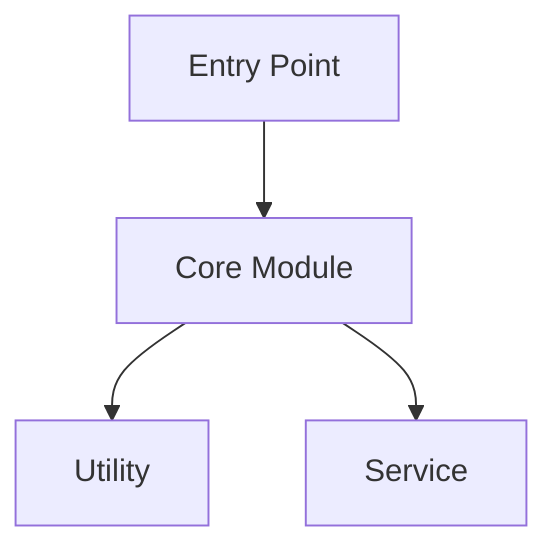

# Generate Knowledge Graph

Create a contextual knowledge graph of the codebase.

## Description

Map dependencies, examine key components, and visualize their interconnections within a codebase.

## Requirements

- `$ARGUMENTS` format: `path [options]`
- **path**: Target codebase location
- **options**:
  - `--include-tests`: Include test files in analysis
  - `--depth=N`: Analysis depth (1=shallow, 2=medium, 3=deep)

## Instructions

1. **Scan the codebase** at the specified path
2. **Map dependencies**:
   - Import/require statements
   - Package dependencies
   - Inter-module relationships
3. **Identify key components**:
   - Entry points
   - Core modules
   - Utility functions
   - Configuration files
4. **Visualize relationships**:
   - Component hierarchy
   - Data flow
   - Dependency graph

## Output Format

### 1. Component Inventory
List all major components with:
- Name and location
- Primary responsibility
- Key exports/interfaces

### 2. Dependency Map
```
ComponentA
├── imports: ComponentB, ComponentC
├── imported-by: ComponentD
└── external-deps: library1, library2
```

### 3. Relationship Diagram


### 4. Key Insights
- Highly connected components (potential refactoring targets)
- Isolated modules (good separation)
- Circular dependencies (issues to address)

## Examples

```
/knowledge-graph src/
/knowledge-graph . --include-tests --depth=3
/knowledge-graph packages/core
```

## Important Notes

- Large codebases may require depth limits
- Circular dependencies should be flagged as warnings
- Consider generating Mermaid diagrams for visualization
- Track external vs internal dependencies separately

## Source

From https://github.com/kingler/n8n_agent/.claude/commands
